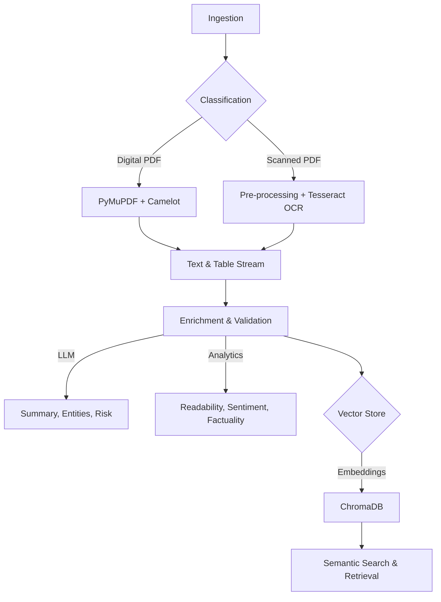

# Tandon AI Document Intelligence

**A Production-Ready Unstructured Document Analytics Framework**

This library implements a modular, end-to-end pipeline for processing unstructured documents (PDFs). It moves beyond simple OCR by integrating automated classification, structured extraction (text & tables), LLM-powered enrichment (risk analysis, summarization), and quality validation.

Designed for high-compliance environments (Engineering, Legal, Finance) where data accuracy and semantic understanding are critical.

## 🏗️ System Architecture



---

## 🚀 Key Features

1.  **Intelligent Ingestion**: Automatically detects if a PDF is **Digital** (selectable text) or **Scanned** (image-based).
2.  **Hybrid Extraction**:
    *   **Digital**: Uses `PyMuPDF` for high-fidelity text extraction and `Camelot` for structured tables.
    *   **Scanned**: Routes through `Tesseract OCR` (pluggable with AWS/Azure) for image-to-text conversion. Includes **auto-deskewing** and **denoising**.
3.  **LLM Enrichment**: Uses OpenAI to:
    *   Summarize content.
    *   Extract key entities (People, Orgs, Dates).
    *   Analyze potential Risks (Legal/Financial).
    *   **Factuality Check**: Scores summary against source text to detect hallucinations.
4.  **Quality Validation Loop**: Automatically scores extraction quality based on text density, OCR noise, and table confidence.
5.  **Research-Grade Analytics**:
    *   **Readability**: Flesch Reading Ease, Gunning Fog Index.
    *   **Semantic**: Sentiment Analysis, Subjectivity, Lexical Diversity.
    *   **Clustering**: PCA & K-Means visualization of document embeddings.
6.  **Vector Store Ready**: Generates embeddings (OpenAI) and stores chunked text in `ChromaDB` for semantic search. Supports **Hybrid Search** (Keyword + Vector) using **Reciprocal Rank Fusion (RRF)** combined with `rank_bm25`.
7.  **Benchmarking & Evaluation**: Includes tools for calculating CER/WER, Recall@k, Precision@k, and nDCG against ground truth. Support for **Dataset Manifests** and **Aggregated Reporting**.
8.  **Cost & Token Tracking**: Detailed tracking of LLM token usage (Input/Output) and cost estimation per document.

---

## 📦 Installation

### Prerequisites
*   Python 3.9+
*   **System Dependencies**:
    *   `tesseract` (for OCR)
    *   `ghostscript` (required by Camelot)
    *   `tk` (required by Camelot)

### Install the Library
Clone the repository and install in editable mode:

```bash
pip install -e .
```

---

## 🖥️ Usage

### 1. Run the Web Dashboard (Dash)
We recommend using the **Dash** dashboard for the best visual experience and advanced analytics.

```bash
python dash_app.py
```
Open **http://127.0.0.1:8050** in your browser.

*Note: The older Streamlit (`app.py`) and Gradio (`gradio_app.py`) apps are available but deprecated.*

### 2. Run Research Benchmarks
For benchmarking extraction quality (CER/WER) and retrieval performance (Recall@k) using a dataset manifest:

```bash
python scripts/run_benchmarks.py \
    --data-dir ./data/test_corpus \
    --manifest ./experiments/dataset_manifest.json \
    --output-csv results.csv \
    --api-key sk-your-key
```

This will generate:
*   `results.csv`: Per-document metrics.
*   `results_summary.csv`: Aggregated statistics (Mean CER/WER, Cost, Throughput).
*   `results_retrieval.csv`: Retrieval metrics (nDCG@k, MRR) if queries are provided.

### 3. Interactive Notebooks
Explore the library capabilities with our tutorial notebooks in `examples/`:

*   [**01_pipeline_demo.ipynb**](examples/01_pipeline_demo.ipynb): Step-by-step walkthrough of the pipeline.
*   [**02_hybrid_search_experiment.ipynb**](examples/02_hybrid_search_experiment.ipynb): Compare Vector Search vs. Hybrid Search (Vector + BM25).

### 4. Use in Python Code

```python
import os
from tandon_ai_doc_intel import DocumentPipeline

# 1. Initialize Pipeline
pipeline = DocumentPipeline(openai_api_key="sk-...")

# 2. Process a Document
result = pipeline.process("invoice.pdf")

# 3. Access Insights
print(f"Validation Score: {result.validation_score}")
print(f"Readability (Flesch): {result.readability_score}")
print(f"Risk Level: {result.risk_analysis['risk_level']}")

# 4. Access Structured Data
if result.tables:
    print(f"Found {len(result.tables)} tables.")
```

---

## 📂 Project Structure

*   `src/tandon_ai_doc_intel/`: Core library package.
    *   `pipeline.py`: Orchestrator for the entire flow.
    *   `ingestion.py`: Handles file loading (paths, bytes).
    *   `classification.py`: Detects digital vs. scanned PDFs.
    *   `extraction/`: Modules for PyMuPDF (digital) and Tesseract (scanned).
    *   `enrichment/`: LLM integration for summary, entities, and risk.
    *   `analytics.py`: Advanced metrics (Readability, Sentiment, NLP).
    *   `validation.py`: Quality assurance checks.
    *   `embeddings/`: Vector generation and storage.
    *   `metrics.py`: Calculation of CER, WER, and Retrieval metrics.
    *   `evaluation.py`: Helper class for ground-truth comparison.
*   `scripts/`: Utility scripts.
    *   `run_benchmarks.py`: Batch processing and evaluation script.
*   `experiments/`: Directory for datasets and experiment configurations.
*   `examples/`: Example notebooks and scripts.
*   `dash_app.py`: The main interactive web application.

## 🤝 Contributing

1.  Fork the repo.
2.  Create your feature branch (`git checkout -b feature/amazing-feature`).
3.  Commit your changes (`git commit -m 'Add some amazing feature'`).
4.  Push to the branch (`git push origin feature/amazing-feature`).
5.  Open a Pull Request.
